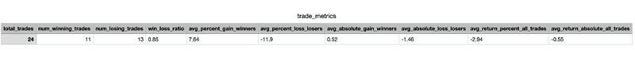
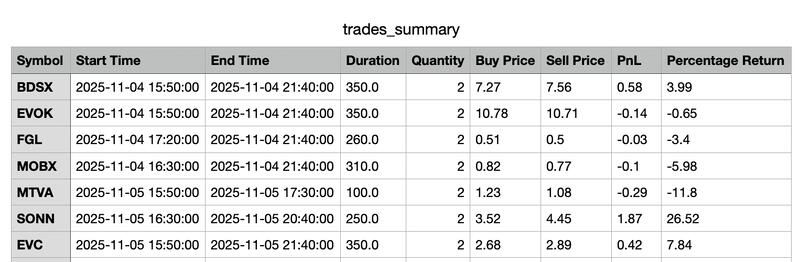

# Event-Driven Algorithmic Trading Backtester

A Python-based event-driven backtesting and live trading framework for algorithmic trading strategies.

## Description

This backtesting suite is based on a guide written by Quantstart's [Michael Halls-Moore](http://www.quantstart.com/about-mike/) on how to write an event-driven backtester and includes improvements made by [Douglas Denhartog](https://github.com/denhartog/quantstart-backtester).

The framework supports both historical backtesting and live trading through Interactive Brokers integration.

## Features

- **Event-Driven Architecture**: Modular design using events for signals, orders, and fills
- **Multiple Data Sources**:
    - CSV files for historical data
    - Database storage for OHLCV data
    - Interactive Brokers API for live/historical data
- **Strategy Development**: Easily implement and test custom trading strategies
- **Performance Analytics**: Evaluate strategy performance with metrics and visualizations
- **Portfolio Management**: Track positions, holdings, and P&L

## Project Structure

```
algotrading/
├── data_handlers/          # Data source adapters (CSV, DB, IB)
├── events/                 # Event classes (Market, Signal, Order Fill)
├── execution_handler/              # Order execution handlers
├── portfolio/              # Portfolio and position management
├── strategies/             # Trading strategy implementations
├── performance.py              # Performance metrics and visualization
├── config/                 # Configuration files
├── ib_client.py/           # Interactive Brokers client wrapper
├── database_population_ohlcv.py    # Storing ohlcv data in database 
├── loop.py                 # Main event loop processing 
├── main.py                 # Main entry point
└── README.md
```

## Usage

1. Add your trading strategies to the `strategies` folder.
2. Configure the database and data sources in the configuration file.
3. Run the backtesting suite:
   ```bash
   python main.py
   ```
4. Visualize the results using the generated metrics and charts.

## Screenshots





## Acknowledgments

- [Michael Halls-Moore](http://www.quantstart.com/about-mike/) for the original guide on event-driven backtesting.
- [Douglas Denhartog](https://github.com/denhartog/quantstart-backtester) for code improvements to the guide.

## License

This project is for educational purposes and is not licensed for commercial use.

## Note

This is a sanitized version of a larger private project, shared for portfolio purposes.