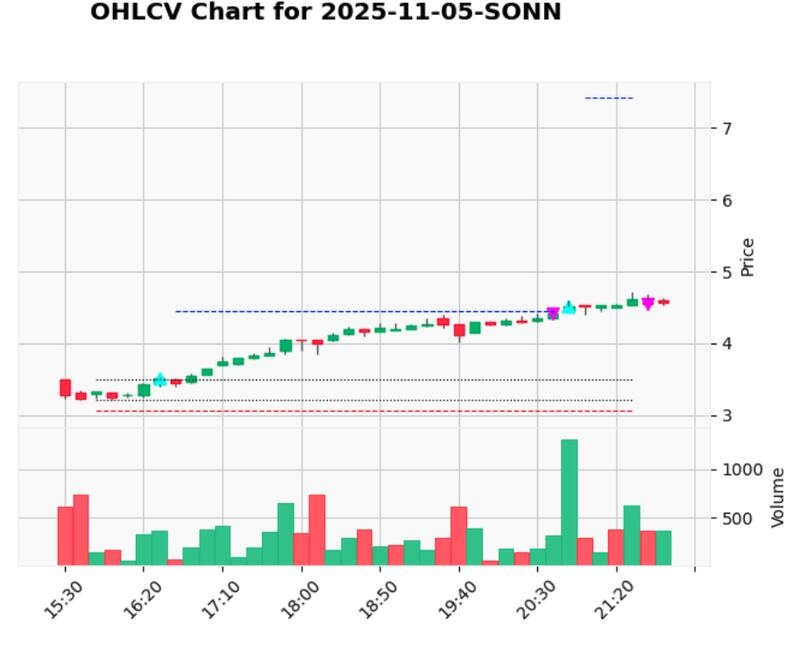

This is a sanitized version of a larger private project for my projects portfolio.

## Description:

This backtesting suite is based on a guide written by Quantstart's [Michael Halls-Moore](http://www.quantstart.com/about-mike/) on how to write an event-driven backtester and also includes improvements to the code in the guide made by [Douglas Denhartog](https://github.com/denhartog/quantstart-backtester).

As a side passion project, I have been developing an Algorithmic Trading bot. It allows me to connect to a trading broker app to get historical and real-time data. I can then code trading strategies (strategies folder) and backtest them on historical data or perform real-time trading on live market data. I visualize my results in metrics and charts to evaluate performance of strategies. The project has taught me a lot about software design and implementation. Working independently on the project, I have to make design decisions keeping performance and scalability in mind. I also got to learn a lot about stock trading, domain knowledge which was essential. For implementation, I am coding in Python with NumPy, pandas, and a few other trading libraries. The application is also connected to a SQLite database which I am maintaining to store historical OHLCV data.

